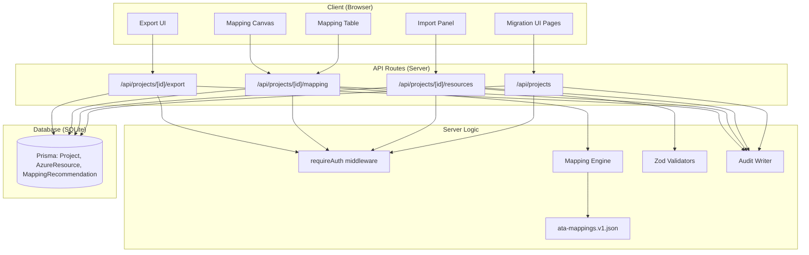

# Design Document: ATA Migration Advisor

## Overview

The Migration Advisor integrates Azure-to-AWS resource mapping into the Cold Network Plane application. It adds a project-based workflow where users import Azure resource inventories, run a deterministic catalog-driven mapping engine, view results in table and canvas formats, and export reports.

The feature is built on CPN's existing infrastructure: session-based auth, Prisma/SQLite database, shadcn/ui components, audit logging, and the App Router layout. No AI/LLM is involved — all mappings come from a versioned JSON catalog.

### Key Design Decisions

1. **Pure mapping engine**: The mapping engine is a pure function with no side effects, making it trivially testable and deterministic.
2. **Catalog as single source of truth**: All mappings come from `data/ata-mappings.v1.json`. No interpolation or guessing.
3. **Reuse CPN auth**: Uses existing session-based auth (not ATA's NextAuth). All API routes validate session via `requireAuth()`.
4. **Prisma schema extension**: New models (Project, AzureResource, MappingRecommendation) added to CPN's existing schema with foreign keys to User.
5. **Client-side canvas**: React Flow + dagre for the mapping visualization, consistent with CPN's existing topology infrastructure.
6. **Audit integration**: New MIGRATION_* event types added to CPN's existing audit taxonomy.

## Architecture



### Data Flow

1. **Import**: User pastes/uploads JSON or enters manually → Zod validates → normalize → persist AzureResource rows
2. **Mapping**: User triggers mapping run → API loads project resources → mapping engine looks up each resource in catalog → persist MappingRecommendation rows
3. **View**: Table/Canvas pages fetch resources + recommendations from API → render
4. **Export**: API loads project data → generate Markdown/CSV → return as downloadable response

## Components and Interfaces

### Mapping Engine (`lib/mapping-engine.ts`)

Pure function module, no database dependencies.

```typescript
interface AwsServiceMapping {
  service: string;
  category: string;
}

interface CatalogEntry {
  azureType: string;
  azureKind: string | null;
  azureSku: string | null;
  category: string;
  awsServices: AwsServiceMapping[];
  confidence: "High" | "Medium" | "Low";
  rationale: string;
  migrationNotes: string;
  alternatives: string[];
}

interface MappingResult {
  matched: boolean;
  awsServices: AwsServiceMapping[];
  confidence: "High" | "Medium" | "Low" | "None";
  rationale: string;
  migrationNotes: string;
  alternatives: string[];
  category: string;
}

function findMapping(azureType: string, azureKind?: string | null, azureSku?: string | null): MappingResult;
function getCatalogCategories(): string[];
function getCatalogStats(): { version: string; totalMappings: number; categories: string[]; uniqueAzureTypes: number };
```

**Matching priority**:
1. type + kind + SKU (exact)
2. type + kind
3. type + SKU (only if catalog entry has no kind)
4. generic type (no kind/SKU in catalog)
5. fallback: first type match with downgraded confidence

### Validators (`lib/validators/resource.ts`)

Zod schemas for input validation.

```typescript
// Manual entry: requires name and type, optional kind/location/sku/subscriptionId/resourceGroup/tags
const manualResourceSchema: z.ZodSchema;

// JSON import: accepts array, {value: [...]}, or {data: [...]} wrappers
// SKU field accepts string, {name: string}, or {tier: string} formats
const importJsonSchema: z.ZodSchema;
```

### Import Utilities (`lib/import-utils.ts`)

Pure normalization functions.

```typescript
interface NormalizedResource {
  name: string;
  type: string;       // lowercased
  location: string | null;
  kind: string | null;
  sku: string | null;
  subscriptionId: string | null;
  resourceGroup: string | null;
  tags: string;        // JSON string
  raw: string;         // JSON string of original payload
}

function normalizeResource(raw: Record<string, unknown>): NormalizedResource;
```

### Canvas Utilities (`lib/canvas-utils.ts`)

Graph building for React Flow visualization.

```typescript
interface CanvasNode {
  id: string;
  type: "azure" | "aws";
  data: { label: string; category: string; count?: number; confidence?: string; resourceId?: string };
  position: { x: number; y: number };
}

interface CanvasEdge {
  id: string;
  source: string;
  target: string;
  data: { confidence: string; azureResourceId: string };
}

function buildCanvasGraph(resources: AzureResourceWithRecommendation[]): { nodes: CanvasNode[]; edges: CanvasEdge[] };
```

The function:
1. Creates Azure nodes (one per resource)
2. Deduplicates AWS service nodes (one per unique service name, with count)
3. Creates edges from Azure nodes to AWS nodes
4. Runs dagre layout (LR direction) to compute positions

### Export Module (`lib/export.ts`)

Report generation functions.

```typescript
function generateMarkdownReport(project: ExportProject): string;
function generateCsvReport(project: ExportProject): string;
```

### API Routes

| Route | Method | Purpose | Auth |
|-------|--------|---------|------|
| `/api/projects` | GET | List user's projects | Required |
| `/api/projects` | POST | Create project | Required |
| `/api/projects/[projectId]` | DELETE | Delete project | Required (owner only) |
| `/api/projects/[projectId]/resources` | GET | List project resources | Required (owner only) |
| `/api/projects/[projectId]/resources` | POST | Import resources (JSON or manual) | Required (owner only) |
| `/api/projects/[projectId]/mapping` | GET | Get mapping results | Required (owner only) |
| `/api/projects/[projectId]/mapping` | POST | Run mapping engine | Required (owner only) |
| `/api/projects/[projectId]/export` | POST | Generate and return report | Required (owner only) |

All routes use `requireAuth()` from `lib/auth/middleware.ts` and verify project ownership before proceeding.

### UI Pages

| Route | Component | Description |
|-------|-----------|-------------|
| `/dashboard/migration` | ProjectListPage | Lists projects with create button |
| `/dashboard/migration/new` | NewProjectPage | Form to create a project |
| `/dashboard/migration/[projectId]` | ProjectDetailPage | Overview with links to import/mapping/export |
| `/dashboard/migration/[projectId]/import` | ImportPage | 3-tab import panel |
| `/dashboard/migration/[projectId]/mapping` | MappingTablePage | Table view with filters |
| `/dashboard/migration/[projectId]/mapping/canvas` | MappingCanvasPage | React Flow visualization |
| `/dashboard/migration/[projectId]/export` | ExportPage | Format selection + download |

### Sidebar Update

Add to `navItems` in `components/app-sidebar.tsx`:

```typescript
{
  title: "Migration Advisor",
  url: "/dashboard/migration",
  icon: ArrowMoveRightTopIcon, // or similar hugeicons migration icon
}
```

### Marketing Page Updates

The existing CPN marketing landing page at `app/(marketing)/page.tsx` is updated to showcase the Migration Advisor feature.

#### Components to Update

1. **`components/marketing/Features.tsx`** — Add a new feature card:
   ```typescript
   {
     icon: ArrowMoveRightTopIcon, // or similar hugeicons migration icon
     title: "Migration Advisor",
     description: "Import Azure resource inventories and get instant, catalog-driven AWS migration recommendations with confidence ratings and exportable reports."
   }
   ```

2. **`components/marketing/Navbar.tsx`** — Add "Migration" anchor link in the nav:
   ```typescript
   <a href="#migration">Migration</a>
   ```

3. **New: `components/marketing/MigrationAdvisor.tsx`** — Dedicated section showcasing the migration workflow:
   - 3-step flow: Import Azure Inventory → Run Mapping Engine → Export Reports
   - Key highlights: 30+ service mappings, confidence ratings, table + canvas views, Markdown/CSV export
   - CTA button: "Try Migration Advisor" → `/dashboard/migration`
   - Uses shadcn Card components and hugeicons, consistent with existing marketing sections

4. **`app/(marketing)/page.tsx`** — Insert `<MigrationAdvisor />` section between `<Features />` and `<HowItWorks />` (or after `<HowItWorks />`).

### Audit Events

New event types added to `lib/audit/events.ts`:

| Event Type | Metadata Fields |
|------------|----------------|
| `MIGRATION_PROJECT_CREATE` | `projectName` |
| `MIGRATION_PROJECT_DELETE` | `projectName` |
| `MIGRATION_RESOURCE_IMPORT` | `projectId`, `resourceCount` |
| `MIGRATION_MAPPING_RUN` | `projectId`, `resourceCount` |
| `MIGRATION_REPORT_EXPORT` | `projectId`, `format` |

## Data Models

### Prisma Schema Extensions

```prisma
model Project {
  id           String   @id @default(cuid())
  name         String
  customerName String   @default("")
  notes        String   @default("")
  createdById  String
  createdAt    DateTime @default(now())
  updatedAt    DateTime @updatedAt

  createdBy User            @relation(fields: [createdById], references: [id])
  resources AzureResource[]

  @@index([createdById])
}

model AzureResource {
  id             String   @id @default(cuid())
  projectId      String
  subscriptionId String?
  resourceGroup  String?
  name           String
  type           String
  kind           String?
  location       String?
  sku            String?
  tags           String   @default("{}")
  raw            String   @default("{}")
  createdAt      DateTime @default(now())

  project         Project                @relation(fields: [projectId], references: [id], onDelete: Cascade)
  recommendations MappingRecommendation[]

  @@index([projectId])
  @@index([type])
}

model MappingRecommendation {
  id               String   @id @default(cuid())
  azureResourceId  String
  awsService       String
  awsCategory      String
  confidence       String
  rationale        String
  migrationNotes   String   @default("")
  alternatives     String   @default("[]")
  createdAt        DateTime @default(now())

  azureResource AzureResource @relation(fields: [azureResourceId], references: [id], onDelete: Cascade)

  @@index([azureResourceId])
}
```

The User model gains a `projects Project[]` relation. Cascade deletes ensure removing a project cleans up all child data.

### Mapping Catalog Schema (`data/ata-mappings.v1.json`)

```json
{
  "version": "1.0.0",
  "description": "...",
  "mappings": [
    {
      "azureType": "microsoft.compute/virtualmachines",
      "azureKind": null,
      "azureSku": null,
      "category": "Compute",
      "awsServices": [{ "service": "Amazon EC2", "category": "Compute" }],
      "confidence": "High",
      "rationale": "Direct IaaS VM equivalent",
      "migrationNotes": "...",
      "alternatives": ["..."]
    }
  ]
}
```

30+ entries covering Compute, Storage, Networking, Database, Containers, Serverless, Messaging, Security, and Monitoring categories.


## Correctness Properties

*A property is a characteristic or behavior that should hold true across all valid executions of a system — essentially, a formal statement about what the system should do. Properties serve as the bridge between human-readable specifications and machine-verifiable correctness guarantees.*

### Property 1: Catalog lookup returns correct match status

*For any* Azure resource type string, `findMapping` SHALL return `matched: true` with a valid confidence level (High/Medium/Low) if the normalized type exists in the catalog, and `matched: false` with `confidence: "None"` if the normalized type does not exist in the catalog.

**Validates: Requirements 3.1, 3.3**

### Property 2: Matching priority ordering

*For any* Azure resource type that has multiple catalog entries with different kind/SKU specificity, `findMapping` called with type+kind+SKU SHALL return the most specific entry. Specifically: type+kind+SKU match takes priority over type+kind, which takes priority over type+SKU, which takes priority over generic type-only match.

**Validates: Requirements 3.2**

### Property 3: Fallback confidence downgrade

*For any* Azure resource type that exists in the catalog but whose provided kind/SKU do not match any refined catalog entry, `findMapping` SHALL return the generic type entry's result with confidence downgraded by one level (High→Medium, Medium→Low, Low→Low).

**Validates: Requirements 3.4**

### Property 4: Import schema accepts three JSON wrapper formats

*For any* valid array of Azure resource objects, the `importJsonSchema` SHALL successfully parse the array when provided as a bare array, wrapped in `{value: [...]}`, or wrapped in `{data: [...]}`, and all three SHALL produce the same parsed resource array.

**Validates: Requirements 2.4**

### Property 5: Import schema rejects invalid input

*For any* input that is not a valid array of objects with at least a `name` and `type` string field, the `importJsonSchema` SHALL reject the input with a Zod validation error.

**Validates: Requirements 2.5**

### Property 6: Resource normalization lowercases type and extracts SKU

*For any* raw resource object with a `type` field containing mixed-case characters, `normalizeResource` SHALL produce a `type` field that is entirely lowercase. *For any* raw resource with a `sku` field that is an object with a `name` property, `normalizeResource` SHALL extract the `name` value as the SKU string.

**Validates: Requirements 2.6**

### Property 7: Canvas graph structure with AWS deduplication

*For any* non-empty list of Azure resources with recommendations, `buildCanvasGraph` SHALL produce exactly one Azure-type node per input resource, exactly one AWS-type node per unique AWS service name across all recommendations (with `count` equal to the number of resources mapping to that service), and one edge per resource-to-service mapping.

**Validates: Requirements 5.1, 5.2**

### Property 8: Dagre layout produces left-to-right positioning

*For any* non-empty list of Azure resources with recommendations, after `buildCanvasGraph` runs dagre layout, all Azure-type nodes SHALL have x-positions strictly less than all AWS-type nodes' x-positions.

**Validates: Requirements 5.4**

### Property 9: Markdown export contains all resource data

*For any* project with at least one resource and one recommendation, `generateMarkdownReport` SHALL produce a string containing every resource name, every mapped AWS service name, every confidence level, every rationale, and every non-empty migration notes value from the input data.

**Validates: Requirements 6.1**

### Property 10: CSV export contains all required columns and data

*For any* project with at least one resource and one recommendation, `generateCsvReport` SHALL produce output containing column headers for Azure Resource Name, Azure Type, Location, AWS Service, Category, Confidence, Rationale, Migration Notes, and Alternatives, and SHALL contain one data row per recommendation.

**Validates: Requirements 6.2**

### Property 11: Manual resource schema rejects empty name or type

*For any* input object where the `name` field is an empty string or the `type` field is an empty string, `manualResourceSchema.safeParse` SHALL return `success: false`.

**Validates: Requirements 8.1**

### Property 12: Import schema handles flexible SKU formats

*For any* valid resource object, the `importJsonSchema` SHALL successfully parse when the `sku` field is a plain string, an object `{name: string}`, or an object `{tier: string}`, extracting the string value in each case.

**Validates: Requirements 8.2**

### Property 13: Validators accept extra fields

*For any* valid resource object with additional arbitrary key-value pairs beyond the schema-defined fields, both `manualResourceSchema` and `importJsonSchema` SHALL parse successfully without rejecting the input.

**Validates: Requirements 8.4**

### Property 14: Table filtering returns only matching items

*For any* list of mapping results and any selected confidence level filter, the filtered results SHALL contain only items whose confidence matches the filter. Similarly, *for any* selected category filter, the filtered results SHALL contain only items whose category matches the filter.

**Validates: Requirements 4.2, 4.3**

## Error Handling

### Import Errors

- **Invalid JSON syntax**: Return 400 with `"Invalid JSON: unable to parse input"`.
- **Zod validation failure**: Return 400 with structured error listing each field violation from `ZodError.issues`.
- **Empty resource array**: Return 400 with `"JSON must contain at least one resource"`.
- **File too large**: Client-side check before upload; reject files > 10MB with user-facing message.

### Mapping Engine Errors

- **Unknown resource type**: Return `MappingResult` with `matched: false`, `confidence: "None"`. This is not an error — it's an expected outcome for unmapped types.
- **Catalog load failure**: If `ata-mappings.v1.json` cannot be loaded, throw at module initialization. This is a fatal configuration error.

### API Route Errors

- **401 Unauthorized**: No valid session cookie or expired session.
- **404 Not Found**: Project does not exist or does not belong to the authenticated user. Intentionally returns 404 (not 403) to avoid leaking project existence.
- **400 Bad Request**: Invalid request body (validation failure).
- **500 Internal Server Error**: Unexpected Prisma or server errors. Log the error server-side; return generic message to client.

### Export Errors

- **No resources**: Return 400 with `"Project has no resources to export"`.
- **No recommendations**: Return 400 with `"Run mapping before exporting"`.

### Audit Errors

- Audit write failures MUST NOT block the primary operation. If audit logging fails, log the error server-side and continue.

## Testing Strategy

### Unit Tests

Unit tests cover pure logic modules with no database dependencies:

- **Mapping Engine** (`lib/mapping-engine.ts`):
  - Exact type match returns correct AWS service
  - Kind-specific match overrides generic type match
  - SKU-specific match works correctly
  - Unknown type returns `matched: false`, confidence `"None"`
  - Fallback with confidence downgrade
  - `getCatalogCategories()` returns expected categories
  - `getCatalogStats()` returns correct counts

- **Validators** (`lib/validators/resource.ts`):
  - `manualResourceSchema` accepts valid input, rejects empty name/type
  - `importJsonSchema` accepts bare array, `{value}` wrapper, `{data}` wrapper
  - SKU parsing: string, `{name}`, `{tier}` formats
  - Extra fields pass through

- **Import Utils** (`lib/import-utils.ts`):
  - Type normalization to lowercase
  - SKU extraction from nested objects
  - Tags and raw serialized as JSON strings

- **Canvas Utils** (`lib/canvas-utils.ts`):
  - Correct node counts (Azure + deduplicated AWS)
  - Edge creation between Azure and AWS nodes
  - Dagre layout produces valid positions

- **Export** (`lib/export.ts`):
  - Markdown report contains summary table and detail sections
  - CSV report has correct columns and row count
  - Empty alternatives handled gracefully

### Property-Based Tests (fast-check)

Property-based tests use `fast-check` to verify universal properties across generated inputs. Each test runs a minimum of 100 iterations.

| Property | Test File | Tag |
|----------|-----------|-----|
| Property 1: Catalog lookup | `lib/__tests__/mapping-engine.property.test.ts` | Feature: ata-migration-advisor, Property 1: Catalog lookup returns correct match status |
| Property 2: Priority ordering | `lib/__tests__/mapping-engine.property.test.ts` | Feature: ata-migration-advisor, Property 2: Matching priority ordering |
| Property 3: Fallback downgrade | `lib/__tests__/mapping-engine.property.test.ts` | Feature: ata-migration-advisor, Property 3: Fallback confidence downgrade |
| Property 4: Three JSON formats | `lib/__tests__/validators.property.test.ts` | Feature: ata-migration-advisor, Property 4: Import schema accepts three JSON wrapper formats |
| Property 5: Invalid input rejection | `lib/__tests__/validators.property.test.ts` | Feature: ata-migration-advisor, Property 5: Import schema rejects invalid input |
| Property 6: Normalization | `lib/__tests__/import-utils.property.test.ts` | Feature: ata-migration-advisor, Property 6: Resource normalization lowercases type and extracts SKU |
| Property 7: Canvas graph structure | `lib/__tests__/canvas-utils.property.test.ts` | Feature: ata-migration-advisor, Property 7: Canvas graph structure with AWS deduplication |
| Property 8: Dagre layout LR | `lib/__tests__/canvas-utils.property.test.ts` | Feature: ata-migration-advisor, Property 8: Dagre layout produces left-to-right positioning |
| Property 9: Markdown export | `lib/__tests__/export.property.test.ts` | Feature: ata-migration-advisor, Property 9: Markdown export contains all resource data |
| Property 10: CSV export | `lib/__tests__/export.property.test.ts` | Feature: ata-migration-advisor, Property 10: CSV export contains all required columns and data |
| Property 11: Empty name/type rejected | `lib/__tests__/validators.property.test.ts` | Feature: ata-migration-advisor, Property 11: Manual resource schema rejects empty name or type |
| Property 12: Flexible SKU | `lib/__tests__/validators.property.test.ts` | Feature: ata-migration-advisor, Property 12: Import schema handles flexible SKU formats |
| Property 13: Extra fields accepted | `lib/__tests__/validators.property.test.ts` | Feature: ata-migration-advisor, Property 13: Validators accept extra fields |
| Property 14: Table filtering | `lib/__tests__/filtering.property.test.ts` | Feature: ata-migration-advisor, Property 14: Table filtering returns only matching items |

### Integration Tests

Integration tests cover API routes with mocked Prisma client:

- **Project routes**: Create, list, delete projects; auth checks; ownership isolation
- **Resource routes**: Import via JSON; manual entry; validation errors; auth checks
- **Mapping routes**: Run mapping; get results; auth checks
- **Export routes**: Markdown and CSV generation; auth checks; error cases (no resources, no mappings)

### Test Configuration

- Framework: Vitest
- Property-based testing: fast-check (already in CPN's dependencies)
- Run command: `npx vitest --run`
- Test files: `*.test.ts` and `*.property.test.ts` co-located in `lib/__tests__/`
- No mocking Prisma for mapping engine tests (pure logic)
- Mock Prisma client in API route integration tests
