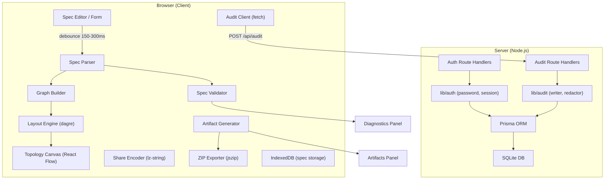
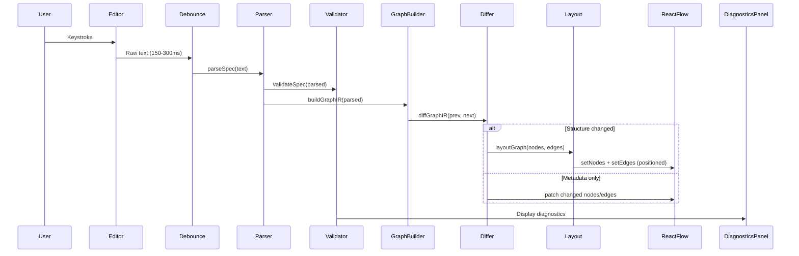

# Design Document: Cold Network Plane MVP

## Overview

The Cold Network Plane MVP is a Next.js 16 App Router application that provides a spec-first Studio for designing hybrid cloud and network topologies. The system is organized into six pillars: Authentication, Studio (spec editing + live topology preview + artifact output), Artifact Generation, Share/Download, Audit Logging, and a Marketing Landing Page.

The architecture follows a strict client/server boundary: Prisma + SQLite handle auth and audit on the server, while spec parsing, graph building, topology rendering, and artifact generation run entirely on the client. Spec content and generated artifacts never touch the server.

## Architecture

### High-Level Architecture



### Route Structure

```
app/
  layout.tsx                          # Root layout (Geist fonts, global providers)
  globals.css
  (marketing)/
    layout.tsx                        # No sidebar, no auth
    page.tsx                          # Landing page at /
  (app)/
    layout.tsx                        # Sidebar + auth guard
    dashboard/
      page.tsx                        # Dashboard home
      studio/page.tsx                 # Studio
      audit/page.tsx                  # Audit log viewer
      settings/page.tsx               # User settings
  login/page.tsx                      # Standalone login
  signup/page.tsx                     # Standalone signup
  api/
    auth/
      login/route.ts                  # POST: authenticate
      register/route.ts               # POST: create user
      logout/route.ts                 # POST: destroy session
      session/route.ts                # GET: validate session
    audit/route.ts                    # POST: log event, GET: list events
```

### Module Structure

| Module | Location | Boundary | Purpose |
|--------|----------|----------|---------|
| `lib/db/` | `lib/db/client.ts` | Server-only | Singleton Prisma client |
| `lib/auth/` | `lib/auth/password.ts`, `session.ts`, `middleware.ts` | Server-only | Password hashing, session CRUD, auth guard |
| `lib/audit/` | `lib/audit/writer.ts`, `redact.ts`, `events.ts`, `client.ts` | Server (`writer`, `redact`) / Client (`client`) | Audit event persistence and client-side logging |
| `lib/spec/` | `lib/spec/schema.ts`, `parser.ts`, `validator.ts`, `graph-builder.ts` | Client-only | Spec parsing, validation, graph IR construction |
| `lib/spec/generators/` | `lib/spec/generators/terraform.ts` | Client-only | Terraform artifact generation |
| `lib/topology/` | `lib/topology/layout.ts`, `node-types.ts`, `edge-types.ts`, `utils.ts` | Client-only | dagre layout, React Flow node/edge types, diffing |
| `lib/contracts/` | `lib/contracts/graph-ir.ts`, `artifact-manifest.ts` | Shared types | Graph IR and Artifact Manifest type definitions |

## Components and Interfaces

### Authentication Components

```typescript
// lib/auth/password.ts
export function hashPassword(plain: string): Promise<string>;
export function verifyPassword(plain: string, hash: string): Promise<boolean>;

// lib/auth/session.ts
export function createSession(userId: string): Promise<{ token: string; expiresAt: Date }>;
export function validateSession(token: string): Promise<{ userId: string } | null>;
export function destroySession(token: string): Promise<void>;

// lib/auth/middleware.ts
export function requireAuth(request: Request): Promise<{ userId: string }>;
// Throws/redirects if session is invalid
```

### Audit Components

```typescript
// lib/audit/events.ts
export type AuditEventType =
  | "AUTH_REGISTER"
  | "AUTH_LOGIN_SUCCESS"
  | "AUTH_LOGIN_FAILURE"
  | "AUTH_LOGOUT"
  | "STUDIO_VALIDATE"
  | "STUDIO_GENERATE_ARTIFACTS"
  | "STUDIO_DOWNLOAD_ZIP"
  | "STUDIO_COPY_SHARE_LINK";

export interface AuditEventInput {
  userId: string;
  eventType: AuditEventType;
  metadata: Record<string, unknown>;
  ipAddress?: string;
  userAgent?: string;
}

// lib/audit/redact.ts
export function redactMetadata(
  eventType: AuditEventType,
  metadata: Record<string, unknown>
): string;
// Returns JSON string, ≤ 1KB, denylisted fields stripped

// lib/audit/writer.ts (server-only)
export function writeAuditEvent(input: AuditEventInput): Promise<void>;

// lib/audit/client.ts (client-safe)
export function logAuditEvent(
  eventType: AuditEventType,
  metadata: Record<string, unknown>
): Promise<void>;
// Calls POST /api/audit via fetch
```

### Spec Engine Components

```typescript
// lib/spec/schema.ts
export interface SpecResource {
  name: string;
  type: string;
  parent?: string;
  properties: Record<string, unknown>;
  dependsOn?: string[];
  connectTo?: string[];
}

export interface ParsedSpec {
  resources: SpecResource[];
  errors: SpecDiagnostic[];
}

// lib/spec/parser.ts
export function parseSpec(rawText: string): ParsedSpec;

// lib/spec/validator.ts
export interface SpecDiagnostic {
  severity: "error" | "warning" | "info";
  message: string;
  line?: number;
  column?: number;
  nodeId?: string;
}

export function validateSpec(parsed: ParsedSpec): SpecDiagnostic[];

// lib/spec/graph-builder.ts
export function buildGraphIR(parsed: ParsedSpec): GraphIR;
// Applies edge resolution rules: containment → reference → inferred
```

### Graph IR Types (from contracts.md)

```typescript
// lib/contracts/graph-ir.ts
export interface GraphNode {
  id: string;           // Canonical: {type}:{name}
  type: string;
  label: string;
  groupId?: string;
  meta: Record<string, unknown>;
}

export interface GraphEdge {
  id: string;           // Canonical: {source}:{target}:{relationType}
  source: string;
  target: string;
  relationType: "containment" | "reference" | "inferred";
  meta: Record<string, unknown>;
}

export interface GraphIR {
  version: "1";
  nodes: GraphNode[];
  edges: GraphEdge[];
}
```

### Artifact Manifest Types (from contracts.md)

```typescript
// lib/contracts/artifact-manifest.ts
export interface ArtifactFile {
  path: string;
  type: string;
  content: string;
  sizeBytes: number;
}

export interface ArtifactManifest {
  version: "1";
  generatedAt: string;
  resourcesCount: number;
  files: ArtifactFile[];
  warnings: string[];
  stats: {
    totalFiles: number;
    totalSizeBytes: number;
    generatorDurationMs: number;
  };
}
```

### Topology Components

```typescript
// lib/topology/layout.ts
export function layoutGraph(
  nodes: GraphNode[],
  edges: GraphEdge[],
  direction?: "TB" | "LR"
): { nodes: PositionedNode[]; edges: GraphEdge[] };
// Uses dagre for auto-layout, only called on structural changes

// lib/topology/utils.ts
export function diffGraphIR(
  prev: GraphIR,
  next: GraphIR
): { added: string[]; removed: string[]; updated: string[] };
// Compares by canonical stable IDs for efficient patching
```

### Studio UI Components

```
components/studio/
  StudioLayout.tsx          # 3-panel resizable layout (react-resizable-panels)
  editor/
    SpecEditor.tsx          # Code editor tab (CodeMirror)
    SpecForm.tsx            # Form-based editor tab
    EditorTabs.tsx          # Tab switcher (Editor | Form)
  preview/
    TopologyCanvas.tsx      # React Flow canvas wrapper
    ResourceList.tsx        # Resource inventory table
    PreviewToolbar.tsx      # Validate, Generate, Share, Download buttons
  output/
    ArtifactViewer.tsx      # Generated file viewer
    DiagnosticsPanel.tsx    # Validation errors/warnings with jump-to
    OutputTabs.tsx          # Tab switcher (Artifacts | Diagnostics)
```

### Marketing Components

```
components/marketing/
  Navbar.tsx                # Sticky nav: logo + links + CTA
  Hero.tsx                  # Hero section with headline + CTA
  Features.tsx              # Feature cards grid (3-4 cards)
  HowItWorks.tsx            # 3-step visual flow
  DemoPreview.tsx           # Static Studio preview placeholder
  CTABanner.tsx             # Full-width CTA
  Footer.tsx                # Minimal footer
```

### Audit UI Components

```
components/audit/
  AuditTable.tsx            # Paginated event table
  AuditFilters.tsx          # Filter by event type, date range, text search
  AuditDetailDrawer.tsx     # Side drawer (sheet) for event metadata
```

## Data Models

### Prisma Schema

```prisma
datasource db {
  provider = "sqlite"
  url      = "file:./dev.db"
}

generator client {
  provider = "prisma-client-js"
}

model User {
  id           String        @id @default(cuid())
  username     String        @unique
  passwordHash String
  createdAt    DateTime      @default(now())
  sessions     Session[]
  auditEvents  AuditEvent[]
}

model Session {
  id        String   @id @default(cuid())
  token     String   @unique
  userId    String
  user      User     @relation(fields: [userId], references: [id])
  expiresAt DateTime
  createdAt DateTime @default(now())

  @@index([token])
  @@index([userId])
}

model AuditEvent {
  id        String   @id @default(cuid())
  userId    String
  user      User     @relation(fields: [userId], references: [id])
  eventType String
  metadata  String   // JSON string, ≤ 1KB after redaction
  ipAddress String?
  userAgent String?
  createdAt DateTime @default(now())

  @@index([userId, createdAt])
  @@index([eventType, createdAt])
}
```

### Client-Side Storage

Spec content is stored in IndexedDB using a thin wrapper (e.g., `idb` library):

```typescript
interface StoredSpec {
  id: string;          // "current" for the active spec
  content: string;     // Raw spec text
  updatedAt: number;   // Timestamp
}
```

Fallback to `localStorage` for specs under 5 KB. Generated artifacts are ephemeral and not persisted.

### Data Flow: Editor → Topology



### Edge Resolution Rules

Per contracts.md, edges are resolved in this priority order:

1. **Containment**: When a resource is nested inside a parent (e.g., subnet inside VPC), emit `relationType: "containment"`. The child's `groupId` matches the parent's `id`.
2. **Explicit Reference**: When a resource field references another by name (e.g., `dependsOn: "firewall-1"`), emit `relationType: "reference"`. The parser resolves to a valid node ID or emits a warning.
3. **Inferred**: When the parser can safely infer a relationship (same group, matching types), emit `relationType: "inferred"` with an info-level diagnostic.

### Canonical Stable IDs

- Node ID: `{type}:{name}` (e.g., `vpc:production`, `subnet:web-tier`)
- Edge ID: `{source}:{target}:{relationType}` (e.g., `vpc:production:subnet:web-tier:containment`)
- IDs are lowercase, alphanumeric + hyphens + colons only
- Stable IDs enable efficient diffing: compare ID sets to determine adds/removes/updates

### Edge Visual Styles

| relationType | Edge Style |
|-------------|------------|
| `containment` | Dashed, muted color |
| `reference` | Solid, default color |
| `inferred` | Dotted, with info icon |


## Correctness Properties

*A property is a characteristic or behavior that should hold true across all valid executions of a system — essentially, a formal statement about what the system should do. Properties serve as the bridge between human-readable specifications and machine-verifiable correctness guarantees.*

The following properties are derived from the acceptance criteria in the requirements document. Each property is universally quantified and designed for property-based testing with `fast-check`.

### Property 1: Password hashing produces verifiable hash

*For any* valid password string (≥ 8 characters), hashing it with `hashPassword` and then verifying the original password against the hash with `verifyPassword` SHALL return true.

**Validates: Requirements 1.1**

### Property 2: Duplicate username rejection

*For any* username that already exists in the database, attempting to register with that same username SHALL result in a rejection, and the total user count SHALL remain unchanged.

**Validates: Requirements 1.2**

### Property 3: Short password rejection

*For any* string shorter than 8 characters, attempting to register SHALL result in a validation error, and no user account SHALL be created.

**Validates: Requirements 1.3**

### Property 4: Session token minimum length

*For any* created session, the generated token SHALL decode to at least 32 bytes in length.

**Validates: Requirements 3.1**

### Property 5: Generic error message for invalid credentials

*For any* login attempt with an incorrect password and *for any* login attempt with a non-existent username, the returned error message SHALL be identical (generic "Invalid credentials").

**Validates: Requirements 2.2**

### Property 6: Audit metadata denylist stripping

*For any* metadata object containing any combination of denylisted fields (password, passwordHash, secret, token, apiKey, credential, specBody, specContent, artifactContent, terraformCode), after redaction by `redactMetadata`, none of those fields SHALL appear in the output at any nesting depth.

**Validates: Requirements 9.2, 1.5, 2.3, 2.4**

### Property 7: Audit metadata long field stripping

*For any* metadata object containing fields whose serialized values exceed 256 characters, after redaction by `redactMetadata`, those fields SHALL be absent from the output.

**Validates: Requirements 9.3**

### Property 8: Audit metadata size cap with truncation marker

*For any* metadata object whose total serialized JSON exceeds 1024 bytes, after redaction by `redactMetadata`, the output SHALL be at most 1024 bytes and SHALL contain a `_truncated: true` field.

**Validates: Requirements 9.4**

### Property 9: Audit event type validation

*For any* string that is not in the set {AUTH_REGISTER, AUTH_LOGIN_SUCCESS, AUTH_LOGIN_FAILURE, AUTH_LOGOUT, STUDIO_VALIDATE, STUDIO_GENERATE_ARTIFACTS, STUDIO_DOWNLOAD_ZIP, STUDIO_COPY_SHARE_LINK}, the `writeAuditEvent` function SHALL reject the event.

**Validates: Requirements 9.6**

### Property 10: Valid spec produces zero error diagnostics

*For any* well-formed spec that conforms to the spec schema, running `validateSpec` SHALL produce a diagnostics list containing zero entries with severity "error".

**Validates: Requirements 5.5**

### Property 11: Graph node count matches resource count

*For any* valid parsed spec, the number of nodes in the Graph IR produced by `buildGraphIR` SHALL equal the number of resources in the parsed spec.

**Validates: Requirements 6.1**

### Property 12: Inferred edges produce info diagnostics

*For any* Graph IR produced by `buildGraphIR` that contains inferred edges, there SHALL be exactly one info-level diagnostic emitted for each inferred edge.

**Validates: Requirements 6.2, 6.3**

### Property 13: Stable ID determinism (idempotence)

*For any* valid spec text, parsing and building the Graph IR twice SHALL produce identical sets of node IDs and edge IDs.

**Validates: Requirements 6.4**

### Property 14: Graph IR diff correctness

*For any* two Graph IRs (prev and next), the diff function SHALL correctly identify: (a) nodes/edges present in next but not prev as "added", (b) nodes/edges present in prev but not next as "removed", and (c) nodes/edges present in both with different metadata as "updated". The union of added, removed, and unchanged IDs SHALL equal the union of all IDs from both graphs.

**Validates: Requirements 6.5**

### Property 15: Layout stability on metadata-only changes

*For any* Graph IR, if only node metadata (label, meta fields) is changed without adding or removing nodes or edges, the Layout Engine SHALL produce identical node positions before and after the change.

**Validates: Requirements 6.6, 6.7, 14.3**

### Property 16: Artifact manifest minimum files

*For any* valid parsed spec with at least one resource, the Artifact Manifest produced by the generator SHALL contain files with paths including at minimum "manifest.json", "artifacts.json", and "README.md".

**Validates: Requirements 7.2**

### Property 17: ZIP contains exactly manifest files

*For any* Artifact Manifest, the ZIP archive produced by the exporter SHALL contain exactly the files listed in `manifest.files` plus `manifest.json` itself, with no extra or missing files.

**Validates: Requirements 8.3**

### Property 18: Share link round-trip

*For any* valid spec text, compressing it with the Share Encoder and then decompressing the result SHALL produce a string identical to the original spec text.

**Validates: Requirements 8.5, 8.6**

### Property 19: Toolbar disabled states — empty spec

*For any* Studio state where the spec content is empty, the Validate and Share toolbar buttons SHALL report a disabled state.

**Validates: Requirements 12.3**

### Property 20: Toolbar disabled states — no artifacts

*For any* Studio state where no artifacts have been generated, the Download toolbar button SHALL report a disabled state.

**Validates: Requirements 12.5**

### Property 21: Resource list matches graph nodes

*For any* Graph IR, the Resource List SHALL contain exactly one row per `GraphNode`, and the count of rows SHALL equal the count of nodes in the Graph IR.

**Validates: Requirements 12.7**

### Property 22: Audit events sorted descending

*For any* set of audit events returned by the audit API, the events SHALL be sorted by `createdAt` in descending order (most recent first).

**Validates: Requirements 10.1**

### Property 23: Audit events filtered by user

*For any* authenticated user querying the audit API, all returned events SHALL have a `userId` matching the authenticated user's ID.

**Validates: Requirements 10.2**

### Property 24: Audit event filters return matching results

*For any* filter criteria (event type, date range) applied to the audit API, all returned events SHALL match the specified filter criteria.

**Validates: Requirements 10.3**

## Error Handling

### Authentication Errors

| Scenario | Response | HTTP Status |
|----------|----------|-------------|
| Invalid credentials (login) | `{ error: "Invalid credentials" }` | 401 |
| Duplicate username (register) | `{ error: "Registration failed" }` | 409 |
| Password too short (register) | `{ error: "Password must be at least 8 characters" }` | 400 |
| Rate limited (login) | `{ error: "Too many attempts. Try again later." }` | 429 |
| Missing/invalid session | Redirect to `/login` (pages) or `{ error: "Unauthorized" }` (API) | 401 |
| Expired session | Same as missing session | 401 |

Error messages MUST be generic for authentication failures to prevent username enumeration. The system MUST NOT reveal whether a username exists.

### Spec Parsing Errors

Spec parsing errors are handled client-side and displayed in the Diagnostics Panel:

- **Syntax errors**: Invalid spec format → error diagnostic with line/column
- **Unknown resource types**: Unrecognized type → warning diagnostic
- **Unresolved references**: `dependsOn` or `connectTo` pointing to non-existent resource → warning diagnostic with the unresolved name
- **Duplicate resource names**: Two resources with the same name and type → error diagnostic

The parser MUST NOT throw exceptions. All errors are captured as `SpecDiagnostic` objects.

### Artifact Generation Errors

- **Unsupported resource type**: Skip the resource, add a warning to `ArtifactManifest.warnings`
- **Empty spec**: Return an empty manifest with a warning
- **Generation failure**: Return a manifest with zero files and an error-level warning

### Audit Errors

- **Metadata too large**: Truncate and add `_truncated: true` (never reject the event)
- **Invalid event type**: Reject with 400 status
- **DB write failure**: Log to server console, return 500 (audit writes SHOULD NOT block user actions)

### Share Link Errors

- **Spec too large for URL**: Display a user-facing warning suggesting download instead
- **Invalid share payload in URL**: Silently ignore, load Studio with empty editor
- **Decompression failure**: Same as invalid payload

## Testing Strategy

### Testing Framework

- **Unit + Integration**: Vitest
- **E2E**: Playwright
- **Property-based testing**: fast-check (minimum 100 iterations per property)

### Unit Tests

Unit tests cover specific examples, edge cases, and error conditions:

- **Spec Parser**: Valid spec → correct AST, empty spec → empty result, malformed spec → error diagnostics, duplicate names → error
- **Spec Validator**: Valid spec → zero errors, missing required fields → errors, invalid types → warnings
- **Graph Builder**: Single resource → one node zero edges, parent-child → containment edge, explicit reference → reference edge, canonical ID format validation
- **Audit Redactor**: Allowlisted fields pass through, denylisted fields stripped, nested denylisted fields stripped, empty metadata handled, 1KB boundary behavior
- **Password utilities**: Hash + verify round-trip, wrong password → false, cost factor ≥ 12
- **Share Encoder**: Empty string round-trip, Unicode round-trip, large spec round-trip

### Property-Based Tests

Each correctness property (Properties 1–24) MUST be implemented as a separate property-based test using fast-check. Each test MUST:

- Run a minimum of 100 iterations
- Reference its design document property with a comment tag
- Tag format: `Feature: cold-plane-mvp, Property {number}: {property_title}`

Property tests focus on universal properties across randomized inputs, complementing unit tests that cover specific examples.

### Integration Tests

- **Auth Routes**: Register → 201 + cookie, duplicate → 409, login valid → 200 + cookie, login invalid → 401, logout → clears session, session check → 200 or 401
- **Audit Routes**: POST valid event → 201, POST oversized metadata → truncated + 201, GET → paginated descending, GET unauthenticated → 401

### E2E Smoke Test

Critical path: Register → Login → Navigate to Studio → Enter spec → Validate → Generate → Download ZIP → Navigate to Audit → Verify events logged.

### Test File Organization

Tests are co-located with source using `__tests__/` directories:

```
lib/auth/__tests__/password.test.ts
lib/auth/__tests__/session.test.ts
lib/audit/__tests__/redact.test.ts
lib/audit/__tests__/writer.test.ts
lib/spec/__tests__/parser.test.ts
lib/spec/__tests__/validator.test.ts
lib/spec/__tests__/graph-builder.test.ts
lib/topology/__tests__/layout.test.ts
lib/topology/__tests__/utils.test.ts
```
